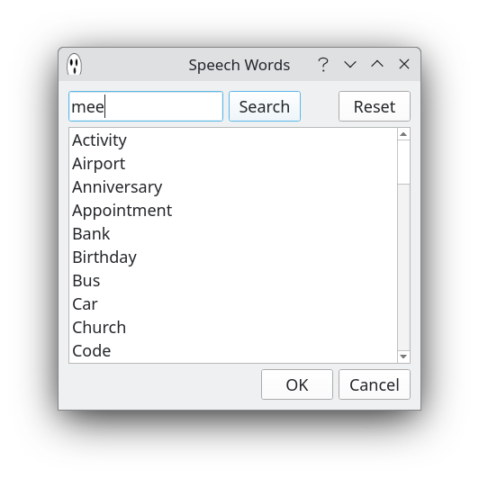
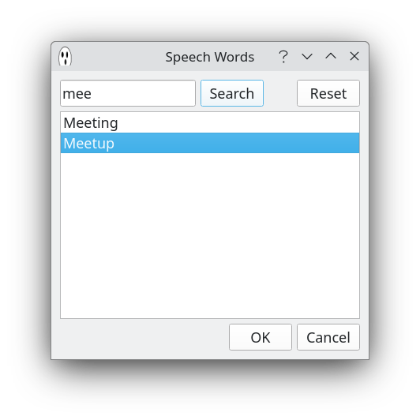
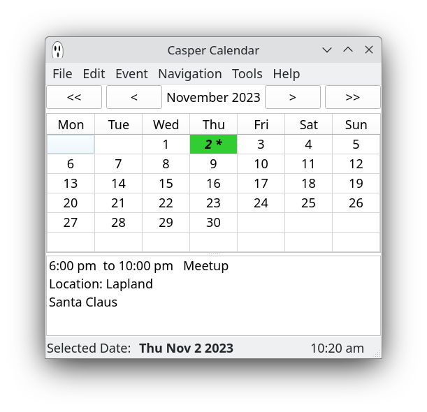

# Casper Calendar (CopperSpice)


## Description

Casper Calendar is a desktop personal calendar built with [CopperSpice](https://www.copperspice.com/) and attempts to be a ghost of my Qt [Talk Calendar](https://github.com/crispinalan/talkcalendar) project.

### Note
This is a CopperSpice project and is being developed using Debian 12 Bookworm. Please read my <ins>[guide](https://github.com/crispinalan/copperspice-debian12-guide)</ins> on how to build CopperSpice on Debian 12. This project will  <ins>not</ins> compile with Qt libraries  as although CopperSpice was initially derived from the Qt framework it has now completely diverged. CopperSpice is a totally open source project released under the LGPL V2.1 license.  With Ubuntu and other distros you can use the pre-built [CopperSpice binary files](https://download.copperspice.com/copperspice/) and then build Casper Calendar from source (see below) using these.

### Features

* built with C++ and CopperSpice 1.8.2
* events can be entered and edited
* events colours can be changed, priority can be  selected  and a reminder set
* built-in word concatenation speech synthesiser for speaking dates and event keywords
* option to change the application font size (DPI monitors)
* scan for upcoming events
* xml file storage
* ICS import (e.g. Google calendar birthdays)
* prebuilt binary for Debian 12 distros


## Installation

### Casper Calendar Prebuilt Binary

A prebuilt binary for Casper Calendar is available and can be downloaded from the [binary folder](https://github.com/crispinalan/caspercalendar/tree/main/binary) which has been built using Debian 12 Bookworm and includes a directory called  <ins>dict</ins> containing word wav files for speaking and the CopperSpice shared libraries to run the application.

The <ins>dict</ins> wav files are for testing purposes only and not of a professional standard. Replace the wav files with you own recordings to personalise your calendar. Record in mono at 8000Hz with a high tempo.

## Casper Calendar Usage

### Adding New Event

* Select event date using the calendar
* To insert a calendar event use the menu item Event->New Event (or press the insert key on the keyboard)
* Enter event details


You can enter event speech keywords using the "Insert Speech Word" button and selecting a word from the list. You can select more than one speech keyword to identify the event or just or type them into the summary box. Consequently summary phrases like "Birthday Party", "Car Service", "Important Reminder" etc. can be used as the speech event type.

The speech words dialog has a search facility. You can start typing for a word e.g. "mee" and press enter and select from the results (in this case Meetup). See screenshots below.








A reminder can be set but Casper Calendar has to be running in the background.

### Editing Existing Event

* Either double click on the event in the list view or select the event  and use the menu item
```
	Event->Update Event
```
* Change details as appropriate.

### Preferences

* Use the menu item
```
	Edit-> Calendar Preferences
```
to change preferences


### Import/Export

A calendar can be exported as an XML file using

File->Export XML Calendar

A calendar can be imported using

File-> New

File->Import XML Calendar

This allows different calendars to be used.

You can import a ICS calendar file (version 2) such as a birthdays calendar (e.g. birthdays.ics) exported from Google Calendar.

File->Import ICS File

Currently only single day imported events are supported. Reminders have to set manually using the "Update Event" dialog.

### Talk

* To read out the date and event keywords for the selected day either

```
press the spacebar
use menu Event->Speak
```

* Enable "Talk At Startup"  to read out the date and event details for the current day when the calendar is started.

* Select "Upcoming Startup" to read out upcoming events when the calendar is started.

The <ins>dict</ins> wav files are for testing purposes only and not of a professional standard. Replace the wav files with you own recordings to personalise your calendar. Record in mono at 8000Hz with a high tempo.

### keys

```
spacebar =speak
insert = new event
u = upcoming events
```


## Compiling Source Code

Visual Studio Code or Geany can be used a source code editor for opening, viewing and then compiling the Casper Calendar files located in the src directory. Both integrate a terminal for building the application.

### Building

To build Casper Calendar from the source code you first need to build CopperSpice. See my [guide](https://github.com/crispinalan/copperspice-debian12-guide) on how to do this. Then use the following terminal commands for building Casper Calendar:

```
mkdir build
cd build
cmake ..
make
```
## Versioning
[SemVer](http://semver.org/) is used for versioning. The version number has the form 0.0.0 representing major, minor and bug fix changes.

## Roadmap

1. Refactor speech engine to use either a [formant](https://github.com/crispinalan/formant-synthesizer) or [diphone speech synthesizer](https://github.com/crispinalan/diphone-speech-synthesizer)
2. Add more calendar features
3. Testing


## License
Casper Calendar is licensed under LGPL v2.1 as CopperSpice (originally derived from Qt4.8) is released under the LGPL V2.1 license.

## Project status
Active, Experimental.

## Author

* **Alan Crispin** [Github](https://github.com/crispinalan) and [Gitlab](https://gitlab.com/crispinalan) and


## Acknowledgements

* [CoperSpice](https://www.copperspice.com/documentation-copperspice.html) is a set of libraries which can be used to develop cross platform  graphical applications in C++. It is an open source project released under the LGPL version 2.1 [license](https://www.copperspice.com/docs/cs_overview/main-cs-license.html)

* [Guide](https://github.com/crispinalan/copperspice-debian12-guide) How to build CopperSpice on Debian 12 (Bookworm).

* [Visual Studio Code](https://code.visualstudio.com/)  is a free source-code editor that can be used with a variety of programming languages, including  C++.

* [Geany](https://www.geany.org/) is lightweight source-code editor.


