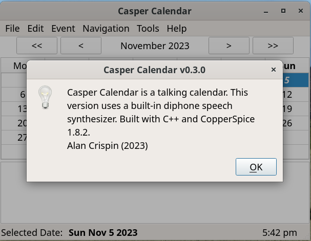

# Casper Calendar (CopperSpice)


## Description

Casper Calendar is a talking desktop calendar built with [CopperSpice](https://www.copperspice.com/) and is a ghost of my Gtk4 [Talk Calendar](https://github.com/crispinalan/talkcalendar) application. It has some added functionality such as saving events in xml file format and calendar colours. It now uses my diphone speech synthesizer which has been re-written in C++. Pre-built binaries are available for Ubuntu 22.04 and Debian 12 Bookworm.

### Features

* bespoke calendar which allows dates with events to be marked up
* event summary, location, description, start and end time can be entered and edited
* events colours can be changed
* multi-day events allowed
* priority and is-yearly can be used
* reminders can be set (Casper Calendar needs to be running in the background)
* built-in diphone speech synthesizer with dictionary
* can check and read out upcoming events
* option to change the application font size (DPI monitors)
* xml file storage
* ICS import (e.g. Google calendar birthdays)
* pre-built binaries for Debian 12 and Ubuntu 22.04 distros

## Installation

### Casper Calendar Pre-built Binaries

### Ubuntu 22.04

A Casper Calendar pre-built binary for Ubuntu 22.04 can be downloaded from the [binary folder](https://github.com/crispinalan/caspercalendar/tree/main/binary). It includes a directory called  <ins>diphones</ins> containing the diphone wav files for speaking and the Ubuntu CopperSpice shared libraries to run the application.

You also need to install the CopperSpice [required packages](https://www.copperspice.com/docs/cs_overview/requirements-unix.html). For Ubuntu 22.04 the package install commands are shown below.

```
sudo apt-get install libfreetype6-dev libfontconfig1-dev libglib2.0-dev libgstreamer1.0-dev \
                libgstreamer-plugins-base1.0-dev libice-dev libaudio-dev libgl1-mesa-dev libc6-dev \
                libsm-dev libxcursor-dev libxext-dev libxfixes-dev libxi-dev libxinerama-dev \
                libxrandr-dev libxrender-dev libxkbcommon-dev libxkbcommon-x11-dev libx11-dev
```

and

```
sudo apt-get install libxcb1-dev libx11-xcb-dev libxcb-glx0-dev libxcb-icccm4-dev libxcb-image0-dev libxcb-keysyms1-dev \
                libxcb-render0-dev libxcb-render-util0-dev libxcb-randr0-dev libxcb-shape0-dev \
                libxcb-shm0-dev libxcb-sync-dev libxcb-xfixes0-dev libxcb-xinerama0-dev libxcb-xkb-dev
```

These required packages are needed if building Casper Calendar from source (see below).

Use a menu editor such as [MenuLibre](https://github.com/bluesabre/menulibre) to create an application launcher for Casper Calendar and add it to the system menu.

### Debian 12 Bookworm

A Casper Calendar pre-built binary for Debian 12 Bookworm can be downloaded from the [binary folder](https://github.com/crispinalan/caspercalendar/tree/main/binary). It includes a directory called  <ins>diphones</ins> containing the diphone wav files for speaking and the Debian CopperSpice shared libraries to run the application.

Again you need to install the CopperSpice [required packages](https://www.copperspice.com/docs/cs_overview/requirements-unix.html) for Debian.

You need to run programs compiled on Debian on Debian and programs compiled on Ubuntu on Ubuntu due to ABI incompatibilites.

## Casper Calendar Usage

### Adding New Event

* Select event date using the calendar
* To insert a calendar event use the menu item Event->New Event (or press the insert key on the keyboard)
* Enter event details


Casper Calendar can read out the event summary, time and location using the built-in diphone speech synthesizer.

Press spacebar to speak the date and event details.

A reminder can be set but Casper Calendar has to be running in the background.

### Editing Existing Event

* Either double click on the event in the list view or select the event  and use the menu item
  
  ```
    Event->Update Event
  ```

* Change details as appropriate.

### Preferences

* Use the menu item
  
  ```
    Edit-> Calendar Preferences
  ```
  
  to change preferences


### Import/Export

A calendar can be exported as an XML file using

File->Export XML Calendar

A calendar can be imported using

File-> New

File->Import XML Calendar

This allows different calendars to be used.

You can import a ICS calendar file (version 2) such as a birthdays calendar (e.g. birthdays.ics) exported from Google Calendar.

File->Import ICS File

Currently only single day imported events are supported. Reminders have to set manually using the "Update Event" dialog.

### Talk

* To read out the date and event keywords for the selected day either

```
press the spacebar
use menu Event->Speak
```

* Enable "Talk At Startup"  to read out the date and event for the current day when the calendar is started.

* Select "Upcoming Startup" to read out upcoming events when the calendar is started.

### Keyboard Shortcuts

```
spacebar =speak
insert = new event
home key = goto today
u = upcoming events
```

### Version

The version number is displayed at the top of the about dialog. Use

```
Help->About
```



## Versioning

[SemVer](http://semver.org/) is used for versioning. The version number has the form 0.0.0 representing major, minor and bug fix changes.

### How is speech generated?

Words are formed as sequences of elementary speech units. A phoneme is the smallest unit of sound that distinguishes one word from another word and there are 44 phonemes in the English language. A diphone is a sound unit composed of two adjacent partial phonemes i.e. the second half of the first phoneme and the first half of the second phoneme. The synthesizer uses a set of pre-recorded diphone sound samples and concatenates diphone wav files to produce speech output for a given text input.

The folder containing the diphone wav files should be placed into the application binary (executable) working directory. The diphone collection was created by Alan W Black and Kevin Lenzo and more information can be found using the links in the Acknowledgements. The diphone license can be found [here](https://github.com/hypnaceae/DiphoneSynth/blob/master/diphones_license.txt).

The diphone speech synthesizer uses a small dictionary of approximately 56,600 English words. If a word is not recognised by the dictionary it is skipped over. More words will be added in future updates.

## Building Source Code

This is a CopperSpice application and will <ins>not</ins> compile with Qt libraries as although CopperSpice was initially derived from the Qt framework it has now completely diverged.

### Ubuntu 22.04

With Ubuntu 22.04 (and other Ubuntu versions) you can use the pre-built CopperSpice binaries listed on their [download site](https://download.copperspice.com/copperspice/). You need to install the [required packages](https://www.copperspice.com/docs/cs_overview/requirements-unix.html#ubuntu22-cs-dev) before using the CMake build system described below.

### Debian 12 Bookworm

To build Casper Calendar from the source code you first need to build CopperSpice. Please read my <ins>[guide](https://github.com/crispinalan/copperspice-debian12-guide)</ins> on how to build CopperSpice on Debian 12 Bookworm as at the time of writing no pre-built CopperSpice binaries are listed on their [download site](https://download.copperspice.com/copperspice/).

### Other Linux distros

Please check the CopperSpice [download site](https://download.copperspice.com/) for binary downloads otherwise build CopperSpice from source as discussed in my <ins>[guide](https://github.com/crispinalan/copperspice-debian12-guide)</ins> .

### Building

[Geany](https://www.geany.org/) or [Visual Studio Code](https://code.visualstudio.com/) can be used as a source code editor for opening, viewing and then compiling the Casper Calendar files located in the src directory. Both code editors have an integrated terminal for building the application.

Then use the following terminal commands for building Casper Calendar:

```
mkdir build
cd build
cmake ..
make
```

## Roadmap

The focus moving forward will be on the Ubuntu 22.04 version of Casper Calendar as there is an official pre-built binary for [CopperSpice](https://download.copperspice.com/copperspice/binary/cs-1.8/).

1. Expand speaking dictionary
2. Audio playback options
3. Investigate using a [formant](https://github.com/crispinalan/formant-synthesizer) synthesizer
4. Packaging

## Reflection

I have found CopperSpice  to be an excellent, stable set of libraries to develop this C++ GUI application.  I like the fact that it uses the LGPL V2.1 license and so does not have the [license restrictions](https://www.phoronix.com/news/Qt-5.15-LTS-Commercial-Phase) imposed by [Qt](https://www.qt.io/licensing/open-source-lgpl-obligations). One thing to consider, from a Linux stand point, is Wayland compatibility. Wayland has been developed as an alternative to X11 on Linux. There is a discussion on the CopperSpice forum [here](https://forum.copperspice.com/viewtopic.php?t=2248).

So what other C/C++ libaries could be used?

[Dear ImGui](https://www.dearimgui.com/) is a cross-platform graphical user interface library for C++ under active development. I have not used this and so cannot comment on its use. It has a [github page](https://github.com/pthom/hello_imgui). The package libimgui-dev is in the Ubuntu package repository and describes itself as "Bloat-free Immediate Mode Graphical User interface for C++".

[Qt6](https://doc.qt.io/qt-6/linux.html) is the latest version of the Qt cross-platform GUI framework. The latest Qt6.5 LTS is only available to [commercial customers](https://www.phoronix.com/news/Qt-6.5-LTS-Commercial-Only). However, it appears that Qt6 versions between LTS releases can be used for open source development due to a special legal agreement with [KDE](https://kde.org/community/whatiskde/kdefreeqtfoundation/). See the [Qt Licensing](https://doc.qt.io/qt-6/licensing.html) page which has a link to purchasing and sales information. Qt6 has Wayland support.

[wxWidgets](https://www.wxwidgets.org/) (formerly known as wxWindows) is a class library for C++ providing GUI components and uses [Gtk3](https://docs.gtk.org/gtk3/). With Debian/Ubuntu you use the libwxgtk3.2-dev package. Gtk3 is still maintained, while GTK 2 is [end-of-life](https://en.wikipedia.org/wiki/GTK);

[Gtk4](https://www.gtk.org/) has succeeded Gtk3 and I started developing a C/Gtk4 talking calendar called Talk Calendar which can found [here](https://github.com/crispinalan/talkcalendar). This has been developed using C and callbacks for event handling. Gtk are deprecating a number of classes in Gtk4.10 (I assume in preparation for Gtk5). I had to update the C/Gtk4 Talk Calendar code on a number of occasions to remove class functions that are on the Gtk4.10 depreciation hit list. The full list of depreciated classes can be found in the [Gtk4 API](https://docs.gtk.org/gtk4/#classes).

[Gtk5](https://www.phoronix.com/news/GTK5-Likely-After-GTK-4.12) is under development and could be [Wayland only](https://www.phoronix.com/news/GTK5-Might-Drop-X11).

## License

Casper Calendar is licensed under LGPL v2.1. CopperSpice is released under the LGPL V2.1 license.

## Project status

Active, Experimental.

## Author

* **Alan Crispin** [Github](https://github.com/crispinalan)

## Acknowledgements

* [CoperSpice](https://www.copperspice.com/documentation-copperspice.html) is a set of libraries which can be used to develop cross platform  graphical applications in C++. It is an open source project released under the LGPL version 2.1 [license](https://www.copperspice.com/docs/cs_overview/main-cs-license.html)

* [Guide](https://github.com/crispinalan/copperspice-debian12-guide) on how to build CopperSpice on Debian 12 (Bookworm).

* [Geany](https://www.geany.org/) is a lightweight source-code editor (version 2 now uses Gtk3).

* [Visual Studio Code](https://code.visualstudio.com/)  is a free source-code editor that can be used with a variety of programming languages, including  C++.

* [Diphone Source and License](https://github.com/hypnaceae/DiphoneSynth/blob/master/diphones_license.txt)

* Diphone collection and synthesis Alan W. Black and Kevin Lenzo [2000](https://www.cs.cmu.edu/~awb/papers/ICSLP2000_diphone/index.html.)
