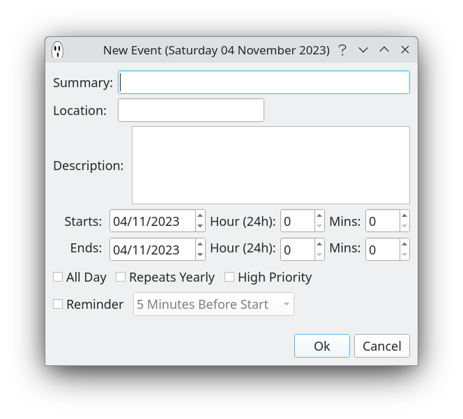
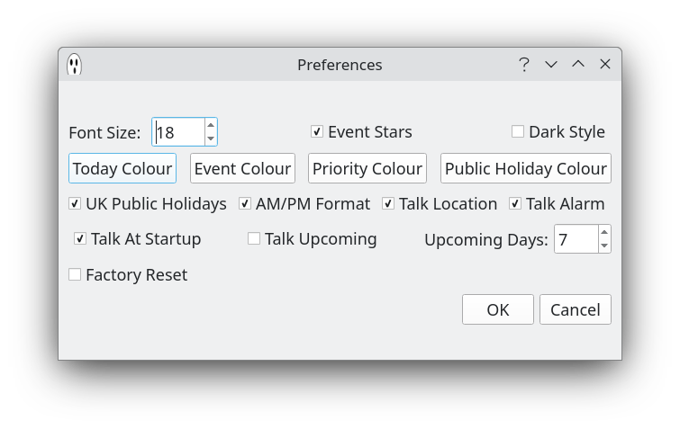

# Casper Calendar (CopperSpice)


## Description

Casper Calendar is a desktop personal calendar built with [CopperSpice](https://www.copperspice.com/) and attempts to be a ghost of my [Talk Calendar](https://github.com/crispinalan/talkcalendar) project.

### Note
This is a CopperSpice project and is being developed using Debian 12 Bookworm. Please read my <ins>[guide](https://github.com/crispinalan/copperspice-debian12-guide)</ins> on how to build CopperSpice on Debian 12. This project will  <ins>not</ins> compile with Qt libraries  as although CopperSpice was initially derived from the Qt framework it has now completely diverged. CopperSpice is a totally open source project released under the LGPL V2.1 license.  With Ubuntu and other distros you can use the pre-built [CopperSpice binary files](https://download.copperspice.com/copperspice/) and then build Casper Calendar from source using these (see instructions below).

### Features

* built with C++ and CopperSpice 1.8.2 on Debian 12 Bookworm
* bespoke calendar which allows dates with events to be marked up
* event summary, location, description, start and end time can be entered and edited
* events colours can be changed
* multi-day events allowed
* priority and is-yearly can be used
* reminders can be set (Casper Calendar needs to be running in the background)
* built-in diphone speech synthesizer with dictionary
* can check and read out upcoming events
* option to change the application font size (DPI monitors)
* xml file storage
* ICS import (e.g. Google calendar birthdays)
* prebuilt binary for Debian 12 distros


## Installation

### Casper Calendar Prebuilt Binary

A prebuilt binary for Casper Calendar is available and can be downloaded from the [binary folder](https://github.com/crispinalan/caspercalendar/tree/main/binary) which has been built using Debian 12 Bookworm and includes a directory called  <ins>diphones</ins> containing the diphone wav files for speaking and the CopperSpice shared libraries to run the application.

## Casper Calendar Usage


### Adding New Event

* Select event date using the calendar
* To insert a calendar event use the menu item Event->New Event (or press the insert key on the keyboard)
* Enter event details




Casper Calendar can read out the event summary, time and location using the built-in diphone speech synthesizer.

Press spacebar to speak the date and event details.

A reminder can be set but Casper Calendar has to be running in the background.

### Editing Existing Event

* Either double click on the event in the list view or select the event  and use the menu item
```
	Event->Update Event
```
* Change details as appropriate.

### Preferences

* Use the menu item
```
	Edit-> Calendar Preferences
```
to change preferences




### Import/Export

A calendar can be exported as an XML file using

File->Export XML Calendar

A calendar can be imported using

File-> New

File->Import XML Calendar

This allows different calendars to be used.

You can import a ICS calendar file (version 2) such as a birthdays calendar (e.g. birthdays.ics) exported from Google Calendar.

File->Import ICS File

Currently only single day imported events are supported. Reminders have to set manually using the "Update Event" dialog.

### Talk

* To read out the date and event keywords for the selected day either

```
press the spacebar
use menu Event->Speak
```

* Enable "Talk At Startup"  to read out the date and event for the current day when the calendar is started.

* Select "Upcoming Startup" to read out upcoming events when the calendar is started.


### Keyboard Shortcuts

```
spacebar =speak
insert = new event
home key = goto today
u = upcoming events
```
### How is speech generated?

Words are formed as sequences of elementary speech units. A phoneme is the smallest unit of sound that distinguishes one word from another word and there are 44 phonemes in the English language. A diphone is a sound unit composed of two adjacent partial phonemes i.e. the second half of the first phoneme and the first half of the second phoneme. The synthesizer uses a set of pre-recorded diphone sound samples and concatenates diphone wav files to produce speech output for a given text input.

The folder containing the diphone wav files should be placed into the application binary (executable) working directory. The diphone collection was created by Alan W Black and Kevin Lenzo and more information can be found using the links in the Acknowledgements. The diphone license can be found [here](https://github.com/hypnaceae/DiphoneSynth/blob/master/diphones_license.txt).

The diphone speech synthesizer uses a small dictionary of approximately 56,600 English words. If a word is not recognised by the dictionary it is skipped over. More words will be added in future updates.


## Compiling Source Code

 Geany or Visual Studio Code (see Acknowledgements below for links) can be used aa a source code editor for opening, viewing and then compiling the Casper Calendar files located in the src directory. Both code editors have an integrated terminal for building the application.

### Building

To build Casper Calendar from the source code you first need to build CopperSpice. See my [guide](https://github.com/crispinalan/copperspice-debian12-guide) on how to do this. Then use the following terminal commands for building Casper Calendar:

```
mkdir build
cd build
cmake ..
make
```
## Versioning
[SemVer](http://semver.org/) is used for versioning. The version number has the form 0.0.0 representing major, minor and bug fix changes.

## Roadmap

1. Preference options for audio playback
2. Expand dictionary
3. Investigate using a [formant](https://github.com/crispinalan/formant-synthesizer) synthesizer
4. Testing


## License
Casper Calendar is licensed under LGPL v2.1. CopperSpice is released under the LGPL V2.1 license.

## Project status
Active, Experimental.

## Author

* **Alan Crispin** [Github](https://github.com/crispinalan)


## Acknowledgements

* [CoperSpice](https://www.copperspice.com/documentation-copperspice.html) is a set of libraries which can be used to develop cross platform  graphical applications in C++. It is an open source project released under the LGPL version 2.1 [license](https://www.copperspice.com/docs/cs_overview/main-cs-license.html)

* [Guide](https://github.com/crispinalan/copperspice-debian12-guide) on how to build CopperSpice on Debian 12 (Bookworm).

* [Geany](https://www.geany.org/) is a lightweight source-code editor (version 2 now uses Gtk3).

* [Visual Studio Code](https://code.visualstudio.com/)  is a free source-code editor that can be used with a variety of programming languages, including  C++.

* [Diphone Source and License](https://github.com/hypnaceae/DiphoneSynth/blob/master/diphones_license.txt)

* Diphone collection and synthesis Alan W. Black and Kevin Lenzo [2000](https://www.cs.cmu.edu/~awb/papers/ICSLP2000_diphone/index.html.)


